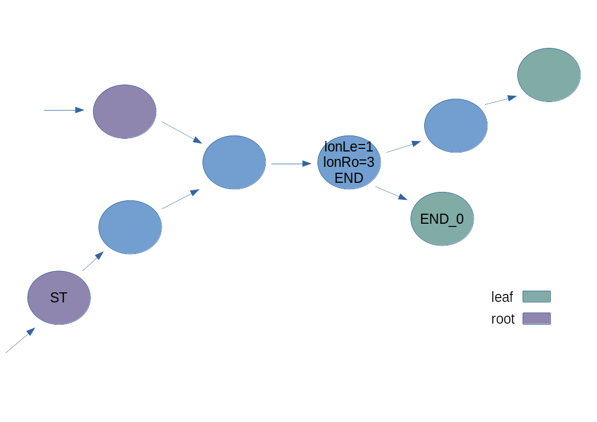

Before showing my solution, It is advised to revise [backtracking](https://en.wikipedia.org/wiki/Backtracking) as my solution is based on it. In fact, It is an enhancement of traditional backtracking where we shall prune already computed branches of the search-tree.

while backtracking, i.e searching within search tree, we maintain a variable _curLe_ which indicates how many nodes we traversed beginning from some root. For instance, _curLe_ is equal to one as it traversed only one node from root _ST_.

We prune search-tree branches via dynamic programming whereby we store the results of our computations. In case we needed to re-compute while going through the search-tree, We return the stored result. Particularly, Each node contains two variables, _longestRoot_ and _longestLeaf_, indicating longest path length from that node to any root, and longest path length from that node to any leaf, respectively.

For instance, assume we started from _ST_ root, reached _END_0_, backtracked and ended-up in _END_ node. _lonLe_ = 1, As there is one node we backtracked beginning from some leaf. Note that _lonLe_ value in this snapshot is not the final possible value, As there are still unvisited leafs. _lonRo_ is already equal to 3 via our _curLe_ as illustrated in the previous figure.

Now, Assume we visited the other leaf _END_0_, then backtracked back again to _END_. In this case we have new leaf length value. Only if it is greater than _lonLe_, we update _lonLe_ to it. As we visited all node _END_ children, We are sure that _lonLe_ is the final correct answer.

As we backtrack, we could conclude _lonLe_ value by adding one. Clearly, its _lonLe_ is equal to the node's ahead of it plus one. Note that, _lonRo_ is already computed via _curLen_ as illustrated earlier.

That is how our graph looks like after completing searching from root _ST_. However, That is not the end of searching, as there is still another root we need to begin searching from.

Now, Are we going to re-compute longest leaf and longest root for each node ahead of root _ST_ again?

In fact, No. The node ahead of _ST_ has _lonLe_ computed, So we do not need to re-compute it again. We already know the longest path from this node to any leaf is 3. In addition, its _lonRo_ = 2, while the length from _ST_ up to it is 1. So, we discovered a shorter path from another root. However, since we are interested in longest paths, we do not update _lonRo_ with 1. But if we discovered a longer path from another root, we would have updated _lonRo_. In either cases, _lonLe_ is left with no modifications. That is how our graph ends up

Finally, we return max(lonLe) among all roots. In this case, the answer is 5.